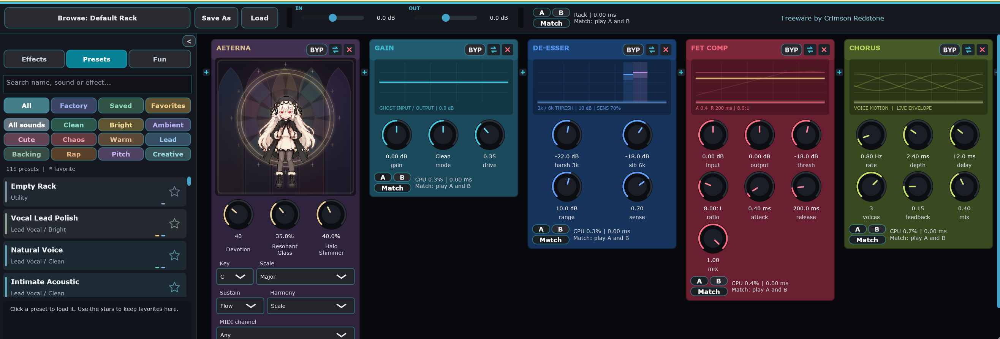

# Vocal Companion

Freeware modular vocal channel strip for post-recorded acoustic vocal, DI, and raw exports from vocal synth softwares.
<p align="center">
  
</p>
This Freeware was made by Crimson Redstone — consider supporting the project
by purchasing music at [crimsonredstone.bandcamp.com](https://crimsonredstone.bandcamp.com).

## Stock modules

| Module | Notes |
|--------|--------|
| Multi-mode Gain | Pure / Clean tube / Dirty overdrive |
| Dual-band De-esser | 2.5–4 kHz synth harsh + 4–8 kHz sibilance |
| FET Peak Comp | 1176-style, 20 µs attack, All-Buttons 20:1 |
| Opto Leveler | RMS glue, 6 dB knee |
| Dynamic EQ + Air | Four dynamic bell bands with independent Q, plus Air shelf |
| Pitch / Formant | YIN detect, scale snap, throat-length shift |
| Width | Das DAFx24 two-band decorr (velvet / allpass), Lo/Hi, transient dry-pass |
| Chorus / Phaser / Tremolo / Auto-Pan | tempo-sync LFOs |
| BPM Delay + Ducking Reverb | ping-pong delay; sidechain-ducked tails |
| WaveShaper | Editable points, segment tension, Single/Double Curve and Hold modes |
| Tube Overdrive | Oversampled biased tube-style saturation with sag |
| RAT Distortion | Oversampled RAT-inspired clipping, filter and slew controls |
| External host card | Scan installed VST3 effects (also AU on macOS) |

## Changes in 1.2.0

The card header now contains square **D** (duplicate) and expand buttons beside BYP, Replace and Delete. Expand or double-click the card background/title to open Full controls. The compact card retains all its existing controls; Full adds an **ADVANCED** section with the settings below. Its window scrolls when necessary. Double-click a value for exact numeric entry.

| Effect | Additional Full controls |
| --- | --- |
| Gain | Even-harmonic amount in Clean/Dirty modes; DC rejection cutoff |
| De-esser | Harsh and sibilance band frequencies; detection attack |
| FET compressor | Detector high-pass (20 Hz setting bypasses it); nonlinear FET colour |
| Opto compressor | Knee width; detector averaging window |
| Limiter | Additional peak hold; release-time multiplier |
| Dynamic EQ | Dynamics threshold, attack and release; four bell frequencies |
| Parametric EQ | Three independent bell Q values; high-pass and low-pass resonance |
| M/S EQ | Independent mid/side bell frequencies; bell Q |
| Pitch / Formant | Independent transposition; correction amount |
| Auto Tune | Correction amount; note-switch hysteresis |
| Width | Original stereo-side level; transient recovery time |
| Air / Breath | Air shelf frequency; generated breath texture level |
| Exciter | Harmonics and warmth crossover frequencies |
| Ring Mod | Sine-to-square carrier blend; carrier bias toward unmodulated audio |
| Bitcrush | Quantizer companding curve; original stereo preservation |
| Chorus | Right-channel delay offset; sine-to-triangle modulation blend |
| Phaser | Sweep span multiplier; modulation phase offset |
| Tremolo | Modulation phase offset; amplitude-envelope curvature |
| Auto Pan | Sine-to-triangle modulation blend; pan centre |
| Delay | Wet-signal ducking; duck recovery time |
| Reverb | Predelay of the wet feed; duck recovery time |
| Breath Control | Reduction attack; minimum detected-breath duration |
| Vocal Rider | RMS averaging window; return time during silence |
| Plosive Control | Burst attack and hold; required low-frequency energy ratio |
| WaveShaper | Input bias before shaping; DC rejection cutoff |
| Tube Overdrive | Input low cut; tube-stage bias |
| RAT Distortion | Input low cut; diode clipping threshold |
| Aeterna | Choir stereo width, glass resonance feedback, shimmer feedback, choir formant offset |
| External effect | Opens the hosted effect's own editor (or JUCE generic editor when available) |

Timing controls require a changing signal, EQ frequency/Q controls require an active band, and delay duck recovery requires nonzero ducking. Full settings are active even when the window is closed. They are saved with presets, A/B and projects, and copied independently when duplicated. Host automation uses appended stable parameter IDs; compact-card parameter IDs remain unchanged.

Implementation: `VcModule` combines core descriptors with an append-only advanced registry. Each DSP module reads its own advanced atomic values. This avoids separate editor-only state and keeps history, automation and serialization on one parameter path. Existing presets without advanced properties restore the advanced defaults.

Validation for 1.2.0: Linux Release VST3 build and the full regression suite passed. The new regression exercises changed advanced settings in all 28 built-in modules, checks state recall and host-lane independence, and verifies compact/full bounds and square header placement. Windows/macOS, third-party editors and interactive DAW behavior still require target-system testing.

## Changes in 1.1.0

- **DUP** copies a card, including its A/B settings, into an independent instance.
- **FULL**, or double-clicking the card background/title, opens larger controls. Double-click a numeric value for precise entry.
- **Undo / Redo** buttons and Ctrl/Cmd+Z, Shift+Ctrl/Cmd+Z (or Ctrl/Cmd+Y) restore rack edits, including deleted cards. History is session-local.
- Automation belongs to a card UUID and parameter ID, so moving or deleting cards cannot redirect it to a different effect. Duplicates and newly loaded presets receive new identities.
- Selected A/B buttons remain dark with bold text across skins.
- Dynamic EQ adds four Q controls; Auto Tune responds faster at low Retune settings and Flex preserves small pitch deviations.
- Plosive Control’s **Monitor** choice now clearly separates **Processed** output from **Removed only** auditioning. Removed-only output can be silent when no burst is detected.
- WaveShaper: double-click the graph to add points, drag circles to shape the curve, drag squares to adjust segment tension, and right-click for curve types or point removal. Shift-drag gives finer movement. Global Tension/Asym control built-in modes; custom Points mode uses per-segment tension. This is an independent implementation, not an exact Fruity WaveShaper DSP clone.
- External effects use a persistent installed-plugin browser. Use **Scan / manage installed effects** to scan supported locations, then select an effect. A plugin cannot access a DAW’s private plugin catalog or load DAW-native effects; VST2 DLL and CLAP hosting are not supported.

### Automation compatibility

The registry reserves 1,024 host parameter slots per session. Deleted-card slots remain reserved so existing DAW automation cannot affect unrelated effects. When all slots are occupied, additional controls remain editable but cannot receive new host automation slots. Older sessions without a registry migrate their existing parameter order once on load; this cannot repair automation already misassigned in an older saved session. Save a backup before upgrading an existing project.

### Developer notes

`PluginProcessor` owns the stable automation registry and bounded undo/redo snapshots. `Chain::duplicate` creates a fresh UUID while copying module state. Card and rack A/B snapshots serialize custom WaveShaper points. The audio thread copies curve changes with a try-lock and evaluates a fixed-size lookup table. `Drive.h` provides independent tube-inspired and RAT-inspired models with 2x oversampling and latency-aligned dry paths. Comments beside these mechanisms describe their invariants.

Validation for this revision: Linux Release VST3 and regression executable built successfully; the full regression suite passed, including identity/history/state recall, control layout, pitch correction, drive stability and latency at 44.1/48/96 kHz, and existing Aeterna tests. Windows/macOS builds, third-party plugin scanning and interactive DAW integration still require testing on the target systems.

## Build

Builds VST3, CLAP and a standalone application on Windows, macOS and Linux,
plus Audio Unit on macOS. Includes effect cards, presets, per-card and rack
settings A/B, optional level matching, external plugin hosting, and the
Aeterna effect with optional MIDI harmony.


Requires CMake 3.22 or newer, Git, and a C++20 compiler. First configuration
fetches JUCE 9.0.1 and clap-juce-extensions from their upstream repositories.

### Windows

Install Visual Studio 2022 with **Desktop development with C++**, CMake and
Git. Run `build.bat` from the extracted repository folder. It writes a local
`build.log` and attempts to install the VST3. Use `build.bat nopause` to skip
the final keypress.

### macOS

Install Xcode Command Line Tools (`xcode-select --install`), CMake and Git.
Run `build_mac.command`; if necessary run `bash build_mac.command` in Terminal.
It builds and copies AU/VST3 bundles into your user audio-plugin directories.

### Linux

On Ubuntu/Debian, install the build dependencies:

```bash
sudo apt-get install git cmake g++ pkg-config \
  libasound2-dev libjack-jackd2-dev libfreetype-dev \
  libx11-dev libxcomposite-dev libxcursor-dev libxext-dev \
  libxinerama-dev libxrandr-dev libxrender-dev \
  libglu1-mesa-dev mesa-common-dev
```

Build from the repository root:

```bash
cmake -S . -B build -DCMAKE_BUILD_TYPE=Release
cmake --build build --config Release --parallel
```

Outputs are under `build/VocalCompanion_artefacts/Release/`. Rescan plugins
in your DAW after installation. To install the Linux standalone application,
menu launcher and icons for your user:

```bash
cmake --install build --prefix "$HOME/.local" --component Standalone
```

Ensure `$HOME/.local/bin` is on your desktop session's PATH. An additional
launcher pointing to the build-tree executable is generated alongside the
Release output folders.

### Build options

| Option | Default | Purpose |
| --- | --- | --- |
| `VC_ENABLE_CLAP` | `ON` | Build the CLAP wrapper |
| `VC_ENABLE_LTO` | `ON` | Enable release link-time optimization |
| `VC_BUILD_UI_TESTS` | `OFF` | Build the native regression executable |

Pass options during configuration, for example `-DVC_ENABLE_CLAP=OFF`.
To run the regression suite:

```bash
cmake -S . -B build -DVC_BUILD_UI_TESTS=ON -DCMAKE_BUILD_TYPE=Release
cmake --build build --config Release --target VocalCompanionUiTests
```

Run `VocalCompanionUiTests` (Windows: `.exe`) from
`build/VocalCompanionUiTests_artefacts/Release/`, passing a writable output
folder for screenshots as its first argument.

## Icons

The supplied Aeterna artwork is wired into Windows resources and VST3 folder
icons, macOS bundles, and Linux standalone launchers/window icons. Windows
folder attributes are applied during configuration and installation. macOS
ICNS files are generated at build time. DAW browsers and operating-system
file associations may still choose their own icons.

## Repository layout

- `Source/`: plugin audio processing and interface.
- `Assets/`: required animation and application icons.
- `ThirdParty/`: vendored Signalsmith headers, upstream references and licenses.
- `tests/`: native regression source.
- `cmake/`: platform branding and installation rules.
- `.github/workflows/`: Windows, macOS and Linux build automation.

## License and dependencies

See [LICENSE](LICENSE) for the project's existing license. Dependencies retain
their own licenses. JUCE and clap-juce-extensions are fetched at build time;
Signalsmith license texts and pinned upstream references are included in
[ThirdParty/](ThirdParty/).

Music and project support: https://crimsonredstone.bandcamp.com it's very cool :)
